# ⬡ NanoTubeStory — Diagrammes Mermaid

> Diagrammes techniques de l'application. Visualisables sur GitHub, GitLab, Obsidian, VS Code (extension Mermaid), ou sur [mermaid.live](https://mermaid.live).

---

## Table des diagrammes

| # | Titre | Type |
|---|-------|------|
| [1](#1-architecture-générale) | Architecture générale | `graph` |
| [2](#2-classification-des-nanotubes-par-chiralité) | Classification des nanotubes par chiralité | `flowchart` |
| [3](#3-flux-de-données--interactions-utilisateur) | Flux de données — interactions utilisateur | `flowchart` |
| [4](#4-modèle-de-classes--modules-principaux) | Modèle de classes — modules principaux | `classDiagram` |
| [5](#5-boucle-agentic--tool-use-anthropic) | Boucle agentic — Tool Use Anthropic | `sequenceDiagram` |
| [6](#6-crud-omeka-s--séquence-complète) | CRUD Omeka S — séquence complète | `sequenceDiagram` |
| [7](#7-cycle-de-vie-dune-cartographie) | Cycle de vie d'une cartographie | `stateDiagram` |
| [8](#8-pipeline-de-rendu-3d--buildnanotubegroup) | Pipeline de rendu 3D — buildNanotubeGroup | `flowchart` |
| [9](#9-coordonnées-hexagonales-cube--voisins-et-directions) | Coordonnées hexagonales cube — voisins | `graph` |
| [10](#10-lattice-carbone--projection-sur-cylindre) | Lattice carbone — projection sur cylindre | `flowchart` |
| [11](#11-hexagone-interactif--tube-enfant) | Hexagone interactif — tube enfant | `sequenceDiagram` |
| [12](#12-calcul-chiralité-du-tube-enfant) | Calcul chiralité du tube enfant | `flowchart` |
| [13](#13-gantt--workflow-utilisateur-typique) | Gantt — workflow utilisateur typique | `gantt` |

---

## 1. Architecture générale

Vue d'ensemble des modules de l'application et de leurs dépendances, incluant les services externes.

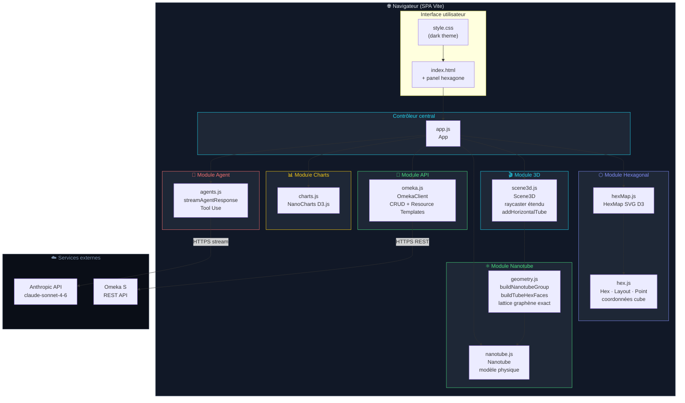

---

## 2. Classification des nanotubes par chiralité

Arbre de décision pour déterminer le type et la conductivité d'un nanotube.

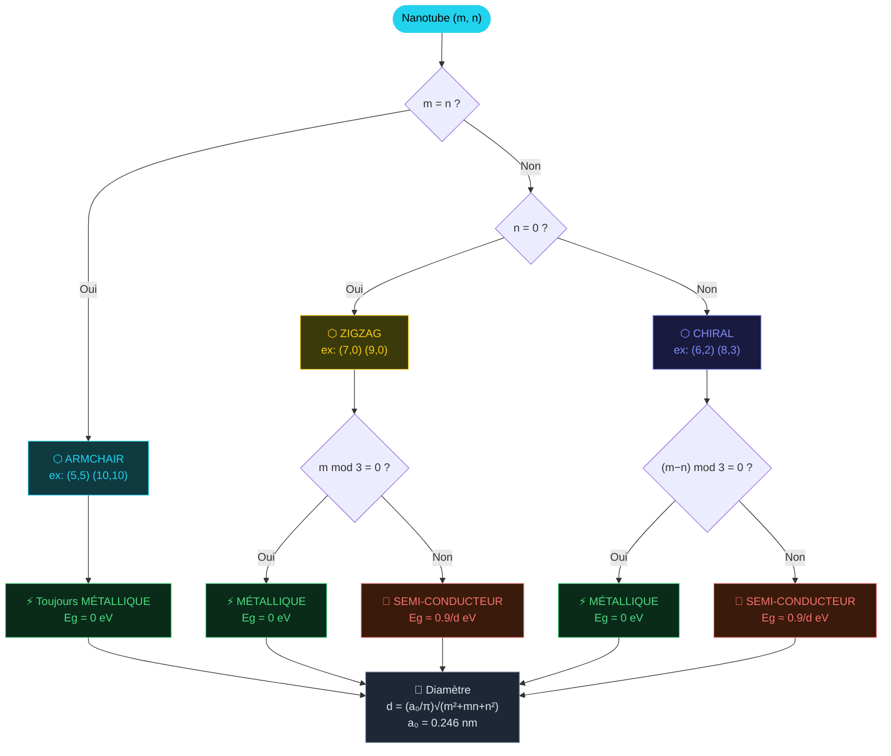

---

## 3. Flux de données — interactions utilisateur

Comment les actions utilisateur traversent les couches de l'application.

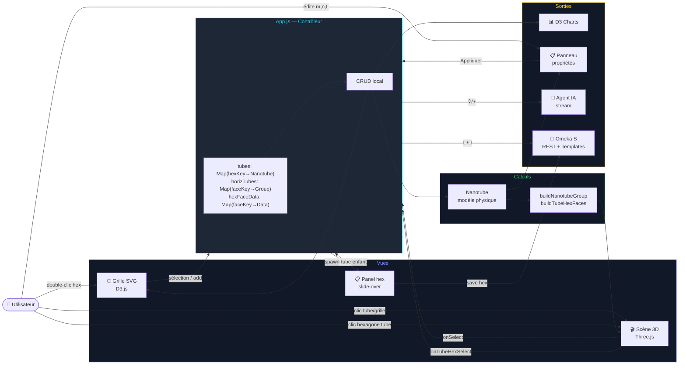

---

## 4. Modèle de classes — modules principaux

Diagramme UML des classes principales, attributs, méthodes et relations.

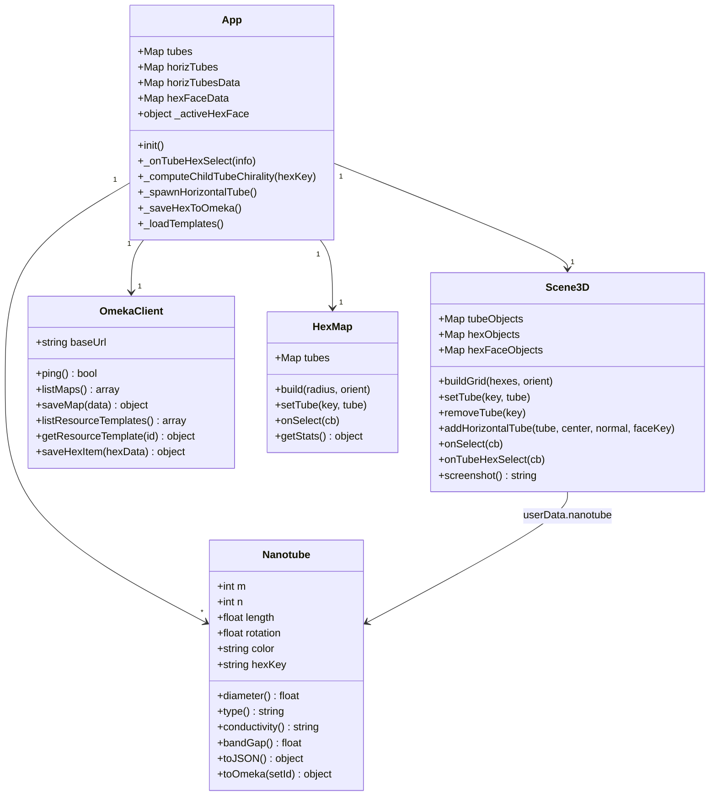

---

## 5. Boucle agentic — Tool Use Anthropic

Séquence multi-tours : streaming, détection des tool calls, exécution locale.

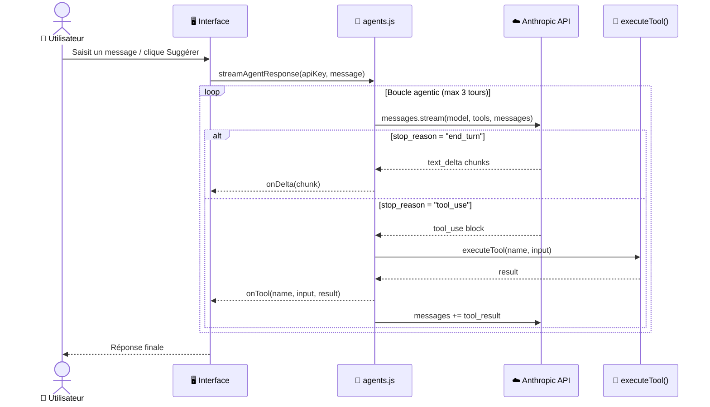

---

## 6. CRUD Omeka S — séquence complète

Toutes les opérations REST : cartographies, hexagones et resource templates.

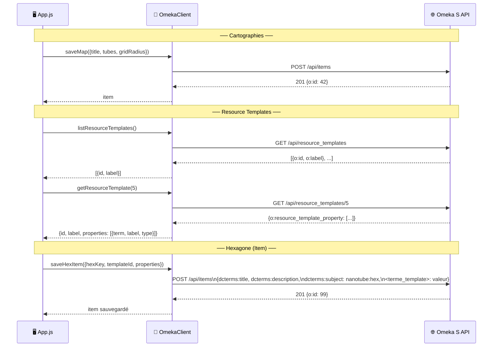

---

## 7. Cycle de vie d'une cartographie

Machine à états depuis la création jusqu'à la sauvegarde.

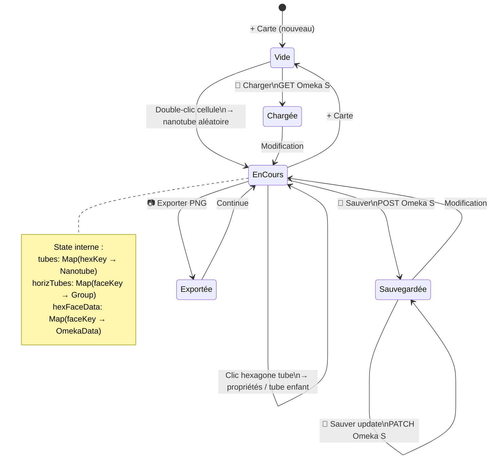

---

## 8. Pipeline de rendu 3D — buildNanotubeGroup

Construction de la géométrie Three.js pour un nanotube.

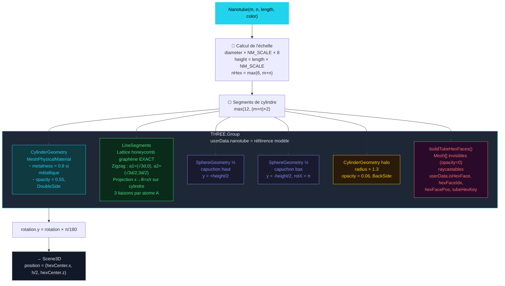

---

## 9. Coordonnées hexagonales cube — voisins et directions

Les 6 directions standard en coordonnées cube et les matrices de conversion.

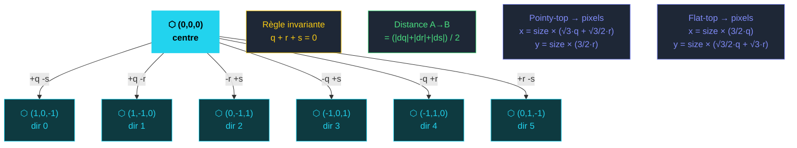

---

## 10. Lattice carbone — projection sur cylindre

Comment le réseau honeycomb graphène 2D est enroulé sur la surface cylindrique du tube.

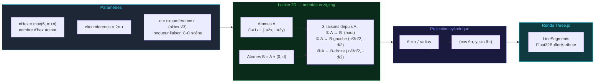

---

## 11. Hexagone interactif — tube enfant

Séquence complète depuis le clic sur un hexagone du tube jusqu'au tube enfant créé.

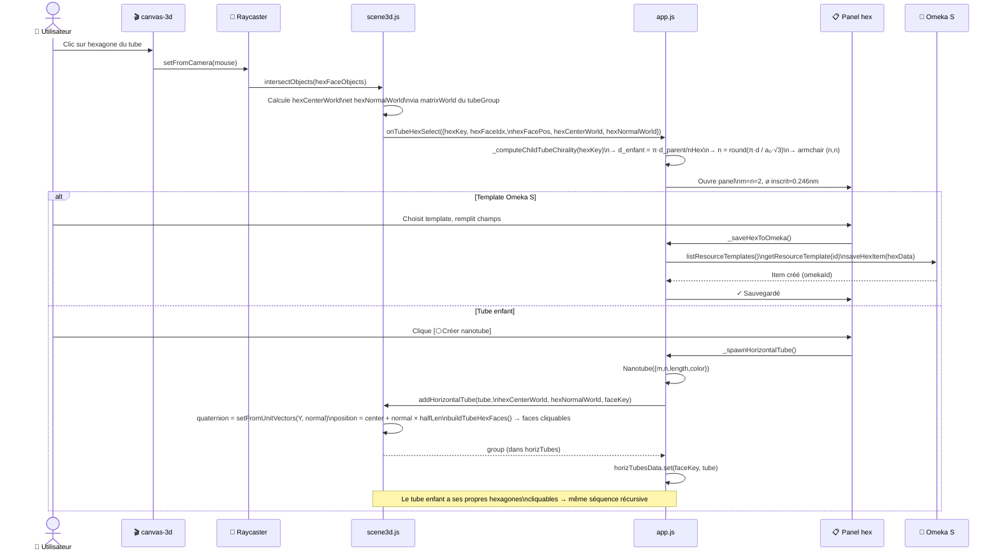

---

## 12. Calcul chiralité du tube enfant

Dérivation des indices `(m, n)` du tube enfant depuis la géométrie de l'hexagone parent.

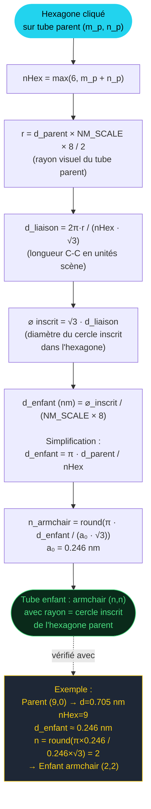

---

## 13. Gantt — workflow utilisateur typique

Chronologie d'une session standard sur NanoTubeStory.

```mermaid
gantt
    title Workflow utilisateur — NanoTubeStory v1.1
    dateFormat  X
    axisFormat %s

    section Configuration
    Ouvrir l'application        :done,    c1, 0, 2
    Configurer Omeka S / API    :done,    c2, 1, 3
    Choisir rayon de grille     :done,    c3, 3, 4

    section Création de tubes
    Placer nanotubes (dbl-clic) :active,  n1, 4, 8
    Éditer chiralité (m,n)      :         n2, 6, 10
    Visualiser réseau honeycomb :         n3, 4, 10

    section Hexagones interactifs
    Cliquer hexagone du tube    :         h1, 10, 11
    Choisir template Omeka S    :         h2, 11, 13
    Remplir propriétés / sauver :         h3, 12, 14
    Créer tube enfant           :         h4, 13, 15
    Explorer récursivement      :         h5, 14, 17

    section Analyse
    Lire graphiques D3          :         a1, 15, 17
    Demander analyse à l'agent  :         a2, 16, 19
    Appliquer suggestions IA    :         a3, 18, 20

    section Sauvegarde
    Saisir un titre             :         s1, 19, 20
    Sauvegarder (Omeka S)       :         s2, 20, 21
    Exporter PNG                :         s3, 20, 22
```

---

*NanoTubeStory v1.1 — Licence MIT*
