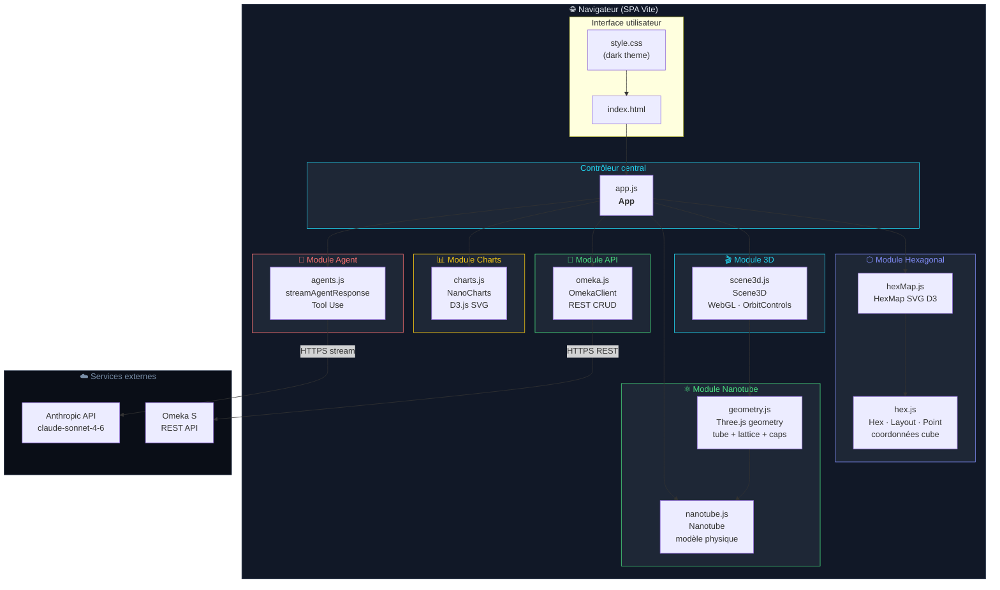
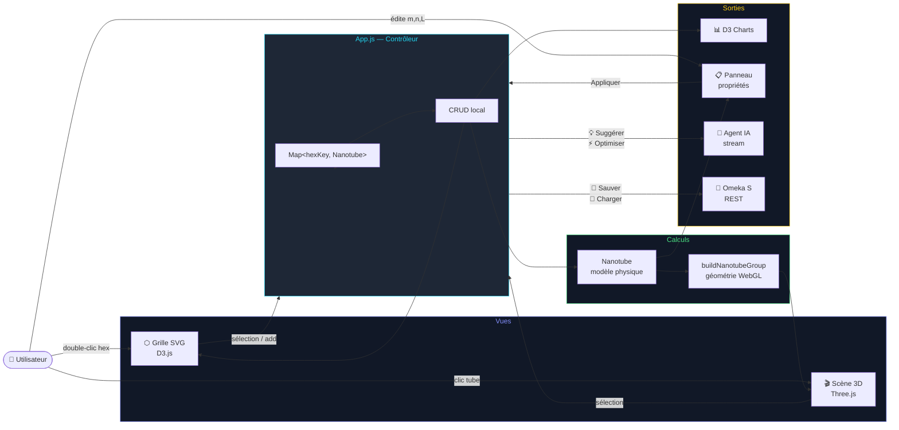
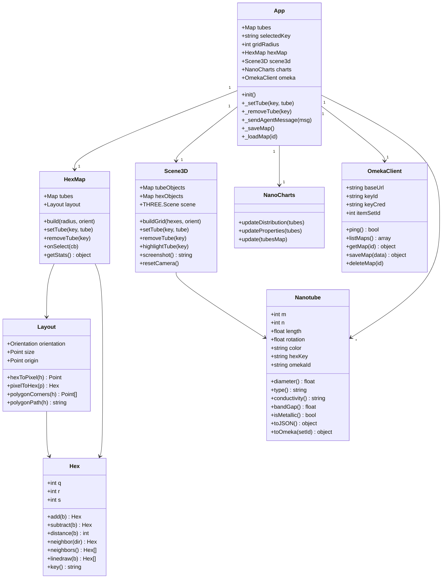
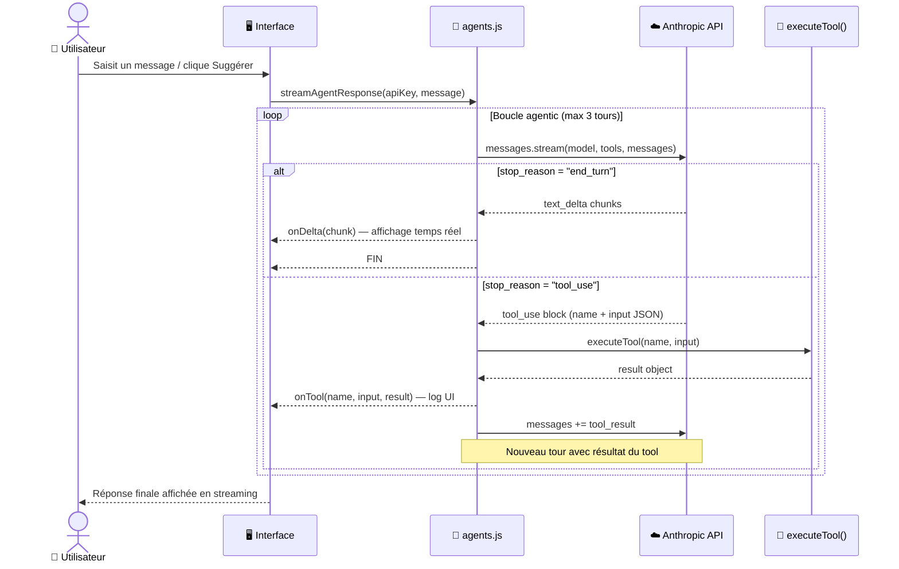
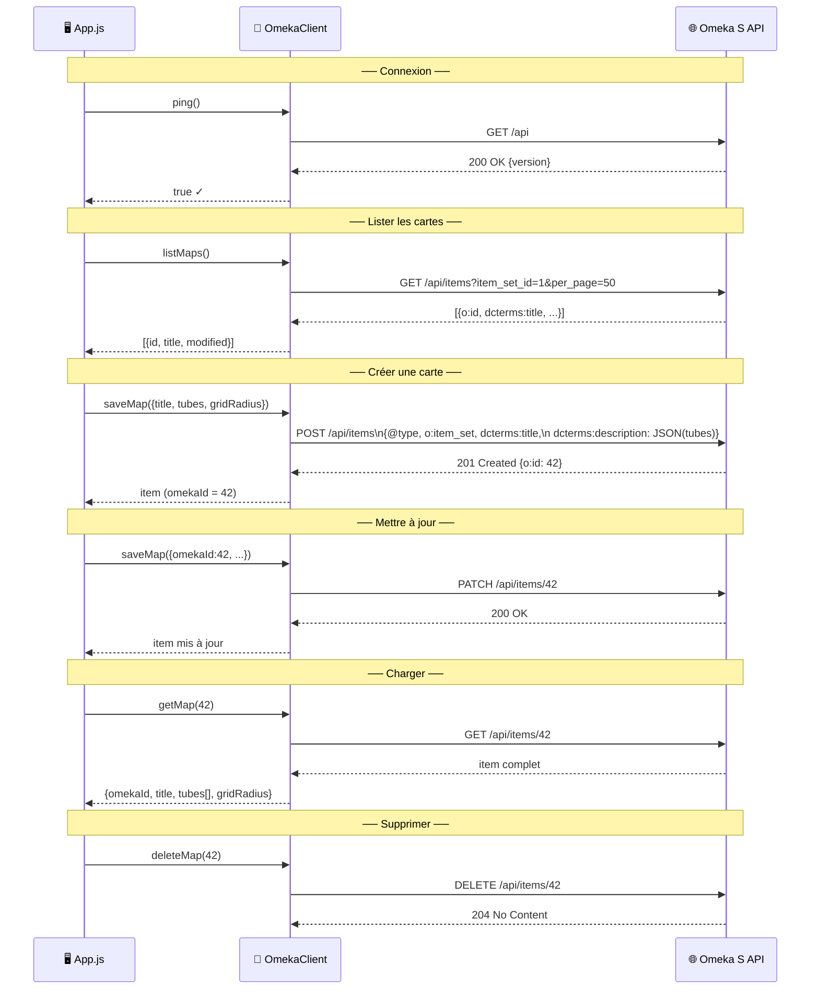
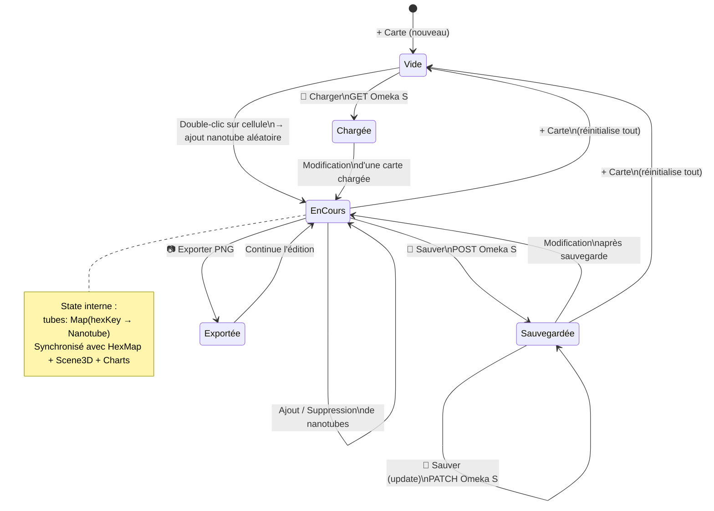
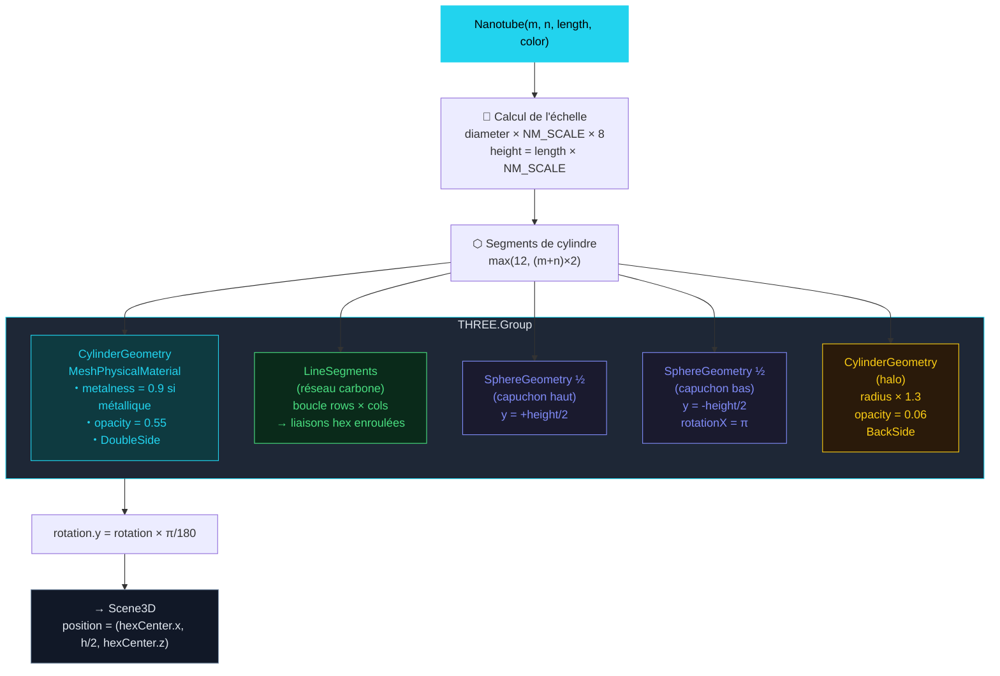
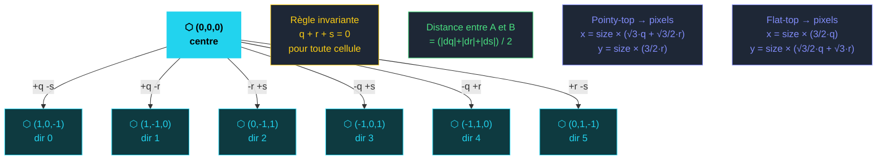

# ⬡ NanoTubeStory — Diagrammes Mermaid

> Diagrammes techniques de l'application. Visualisables sur GitHub, GitLab, Obsidian, VS Code (extension Mermaid), ou sur [mermaid.live](https://mermaid.live).

---

## Table des diagrammes

| # | Titre | Type |
|---|-------|------|
| [1](#1-architecture-générale) | Architecture générale | `graph` |
| [2](#2-classification-des-nanotubes-par-chiralité) | Classification des nanotubes par chiralité | `flowchart` |
| [3](#3-flux-de-données--interactions-utilisateur) | Flux de données — interactions utilisateur | `flowchart` |
| [4](#4-modèle-de-classes--modules-principaux) | Modèle de classes — modules principaux | `classDiagram` |
| [5](#5-boucle-agentic--tool-use-anthropic) | Boucle agentic — Tool Use Anthropic | `sequenceDiagram` |
| [6](#6-crud-omeka-s--séquence-complète) | CRUD Omeka S — séquence complète | `sequenceDiagram` |
| [7](#7-cycle-de-vie-dune-cartographie) | Cycle de vie d'une cartographie | `stateDiagram` |
| [8](#8-pipeline-de-rendu-3d--buildnanotubegroup) | Pipeline de rendu 3D — buildNanotubeGroup | `flowchart` |
| [9](#9-coordonnées-hexagonales-cube--voisins-et-directions) | Coordonnées hexagonales cube — voisins | `graph` |
| [10](#10-gantt--workflow-utilisateur-typique) | Gantt — workflow utilisateur typique | `gantt` |

---

## 1. Architecture générale

Vue d'ensemble des modules de l'application et de leurs dépendances, incluant les services externes (Anthropic API, Omeka S).

---

## 2. Classification des nanotubes par chiralité

Arbre de décision pour déterminer le type et la conductivité d'un nanotube à partir de ses indices `(m, n)`.

---

## 3. Flux de données — interactions utilisateur

Comment les actions utilisateur traversent les couches de l'application, de l'interface jusqu'aux sorties (3D, charts, agent, API).

---

## 4. Modèle de classes — modules principaux

Diagramme UML des classes principales, leurs attributs, méthodes et relations.

---

## 5. Boucle agentic — Tool Use Anthropic

Séquence détaillée de la boucle multi-tours : streaming, détection des tool calls, exécution locale et réponse finale.

---

## 6. CRUD Omeka S — séquence complète

Toutes les opérations REST entre l'application et l'API Omeka S : connexion, liste, création, mise à jour, chargement et suppression.

---

## 7. Cycle de vie d'une cartographie

Machine à états de la cartographie depuis sa création jusqu'à la sauvegarde, avec toutes les transitions possibles.

---

## 8. Pipeline de rendu 3D — buildNanotubeGroup

Décomposition du processus de construction de la géométrie Three.js pour un nanotube, du modèle physique au `THREE.Group` rendu.

---

## 9. Coordonnées hexagonales cube — voisins et directions

Les 6 directions standard en coordonnées cube, la règle d'invariance `q+r+s=0`, le calcul de distance et les matrices de conversion vers les pixels.

---

## 10. Gantt — workflow utilisateur typique

Chronologie des étapes d'une session de travail standard sur NanoTubeStory.

```mermaid
gantt
    title Workflow utilisateur — NanoTubeStory
    dateFormat  X
    axisFormat %s

    section Configuration
    Ouvrir l'application       :done,    c1, 0, 2
    Configurer Omeka S / API   :done,    c2, 1, 3
    Choisir rayon de grille    :done,    c3, 3, 4

    section Création
    Placer nanotubes (dbl-clic):active,  n1, 4, 8
    Éditer chiralité (m,n)     :         n2, 6, 10
    Ajuster longueur / couleur :         n3, 8, 11
    Visualiser en 3D           :         n4, 4, 11

    section Analyse
    Lire graphiques D3         :         a1, 10, 12
    Demander analyse à l'agent :         a2, 11, 14
    Appliquer suggestions IA   :         a3, 13, 16

    section Sauvegarde
    Saisir un titre            :         s1, 15, 16
    Sauvegarder (Omeka S)      :         s2, 16, 17
    Exporter PNG               :         s3, 16, 18
```

---

*NanoTubeStory v1.0 — Licence MIT*
